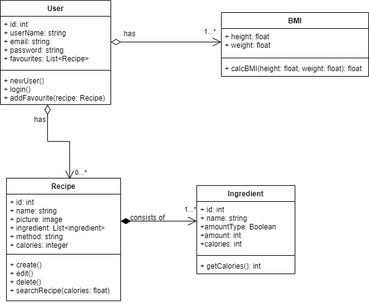

# Dietalicious
Aplikasi yang berfungsi berbasis windows presentation foundation (WPF) yang  berfungsi untuk menghitung BMI, mencari resep makanan sesuai target kalori dan memberikan rekomendasi resep makanan.

Ketua Kelompok: Hervi Nur Rahmandien - 20/463601/TK/51593

Anggota 1: Auletta Khansa Pradiviasari - 20/456359/TK/50489

Anggota 2: Nur Wulan Febriani - 20/460557/TK/51146

## [Panduan Penggunaan Aplikasi](https://drive.google.com/file/d/15TXCNlAXwN8xkjXev70l2zpPPRaurOAj/view?usp=sharing "Panduan Penggunaan Aplikasi Dietalicious")

## Class Diagram

## ERD

